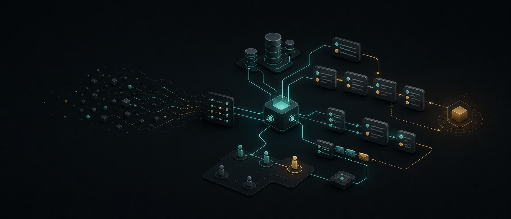

# Артём Лиске



> **Превращаю бизнес-процессы в надёжное программное обеспечение.**
>
> Backend и full-stack инженер: CRM, Telegram-боты, личные кабинеты и внутренние сервисы — от бизнес-правил до боевого запуска.

[English version](README.en.md) · [Портфолио](https://artyomliske.github.io/?lang=ru) · [Telegram](https://t.me/artyomliske) · [Email](mailto:artyomliske@gmail.com)


## Что я создаю

Я превращаю рабочие процессы в прозрачные и поддерживаемые системы: записи, оплаты, роли, отчётность, согласования и клиентские сценарии. Начинаю с правил, по которым работает бизнес, и довожу их до программного решения, которому можно доверять.

| Направление | Результат |
|---|---|
| **Автоматизация бизнеса** | CRM, административные панели, цепочки согласований, Telegram-боты |
| **Надёжный backend** | Доменные правила, REST API, фоновые задачи, понятные изменения состояний |
| **Клиентские продукты** | PWA, личные кабинеты, регистрация, запись и оплата |
| **Запуск в production** | Тесты, миграции, Docker Compose, CI и архитектура, готовая к наблюдаемости |

## Избранный проект

### [Booking Rules Demo](https://github.com/artyomliske/booking-rules-demo)

Самостоятельная реализация безопасного бронирования ресурсов на FastAPI и PostgreSQL. В проекте есть тесты доменной логики и API, Docker Compose, CI через GitHub Actions и ограничение PostgreSQL, которое не позволяет создать пересекающиеся бронирования на уровне базы данных.

## Избранные системы

| Проект | Что автоматизировано | Стек |
|---|---|---|
| [StudioCRM](https://github.com/artyomliske/studio-crm-case) | Записи, оплаты, производство и Telegram-автоматизация контент-студии | Python · FastAPI · PostgreSQL · Redis · aiogram |
| [Chip House CRM](https://github.com/artyomliske/chip-house-crm-case) | Турниры, рассадка, живое табло и сезонный рейтинг | TypeScript · NestJS · React · Prisma · Socket.IO |
| [Chip House Club](https://github.com/artyomliske/chip-house-club-case) | PWA игрока: рейтинг, достижения и регистрация на турнир | TypeScript · React · Vite · Tailwind CSS · PWA |
| [Рублёвские сказки](https://github.com/artyomliske/rublevskie-skazki-case) | Сайт, билетный сценарий и внутренние процессы театра | Node.js · Express · Prisma |
| [Калькулятор смет](https://github.com/artyomliske/estimate-calculator-case) | Расчёт работ, редактор смет, экспорт документов и аналитика | TypeScript · React · Express · XLSX |
| [SMM-платформа](https://github.com/artyomliske/smm-platform-case) | Создание, согласование и подготовка публикаций через Telegram | Python · FastAPI · aiogram · OpenAI API · PostgreSQL |

## Инженерный подход

```text
РАЗОБРАТЬ ПРОЦЕСС  →  ЗАФИКСИРОВАТЬ ПРАВИЛА  →  СОБРАТЬ РАБОЧИЕ ЭТАПЫ
       →  ПРОВЕРИТЬ КРИТИЧНУЮ ЛОГИКУ  →  ЗАПУСТИТЬ, НАБЛЮДАТЬ, УЛУЧШАТЬ
```

Я уделяю особое внимание тому, что предотвращает дорогие ошибки: пересечениям записей, ценам, предоплатам, ролям, правам доступа и денежным операциям. Такие правила должны быть закреплены ограничениями базы данных, миграциями, валидацией, фоновыми задачами, тестами и явными переходами состояний, а не храниться в памяти сотрудника.

## Стек, подтверждённый проектами

| Направление | Технологии |
|---|---|
| Языки | Python · TypeScript · JavaScript · SQL · HTML · CSS |
| Backend и API | FastAPI · NestJS · Express · Uvicorn · Pydantic · REST · OpenAPI · WebSocket |
| Frontend | React · Vite · Tailwind CSS · React Router · TanStack Query · PWA |
| Данные | PostgreSQL · Redis · SQLAlchemy Async · Alembic · Prisma · asyncpg |
| Интеграции | Telegram / aiogram · Socket.IO · S3 / MinIO · OpenAI API · HTTPX |
| Очереди и доставка | ARQ · APScheduler · Docker Compose · GitHub Actions |
| Качество | pytest · pytest-asyncio · Vitest · Testing Library |

## Давайте сделаем процесс удобнее

Если вы превращаете ручной workflow в продукт, строите внутреннюю систему или хотите сделать существующий процесс надёжнее и понятнее, буду рад обсудить задачу.

[Портфолио →](https://artyomliske.github.io/?lang=ru) · [Написать в Telegram →](https://t.me/artyomliske) · [Email →](mailto:artyomliske@gmail.com)

---

<sub>Практичная автоматизация, явные бизнес-правила и software, который выдерживает встречу с реальными процессами.</sub>
